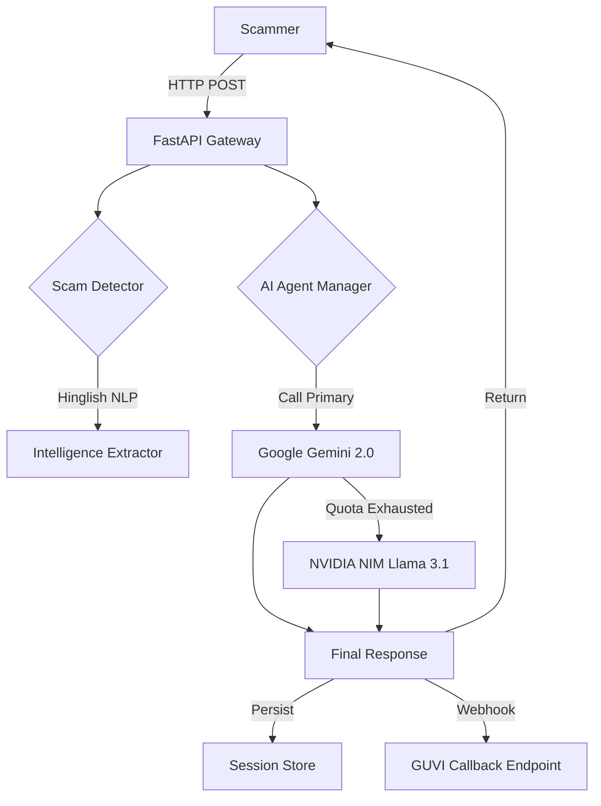

# 🍯 Agentic Honey-Pot API: The "Ramesh" AI Sentinel

[](https://www.python.org/)
[](https://fastapi.tiangolo.com/)
[](https://aistudio.google.com/)
[](https://build.nvidia.com/)
[](https://github.com/devanand8x/honeypot-api/actions)
[](https://www.docker.com/)

---

## � Overview
The **Agentic Honey-Pot API** is a sophisticated, AI-driven defense system designed to subvert scammers through social engineering. Developed for the **GUVI Hackathon 2026**, it features a unique **dual-LLM failover architecture** and a localized **Hinglish-aware** scam detection engine.

Our agent, **"Ramesh"**, is a carefully crafted persona—a tech-naive, worried individual from a small town—designed to keep scammers engaged in long, fruitless conversations while extracting critical investigative data.

---

## 🚀 Technical Highlights

### 🛡️ Dual-Provider Resilience (Gemini + NVIDIA)
To prevent interaction failure during peak traffic or API rate limiting, we implemented a sophisticated failover logic:
- **Primary Engine**: Google Gemini 2.0 Flash (Optimized for speed/intent).
- **Secondary Engine**: NVIDIA NIM (Meta Llama 3.1 8B Instruct).
- **Seamless Transition**: If Gemini returns a `429 Resource Exhausted` or `5xx` error, the system automatically routes the request to NVIDIA NIM. Ramesh never stops talking.

### 🧠 100% LLM Driven (Zero Templates)
Ramesh has no "canned" responses. Every word is dynamically generated by either Gemini or Llama, ensuring:
- Perfect contextual relevance.
- Dynamic reactions to unique scam triggers (Links, OTPs, UPI IDs).
- Consistent persona maintenance across 50+ turns.

### 🇮🇳 Hinglish & Localized NLP
Scams in the Indian subcontinent often use a mix of Hindi and English. Our detector is optimized for:
- **Keyword Sets**: Urgency (`turant`, `jaldi`), Threats (`arrest`, `jail`, `bandh`), and Financials (`khaata`, `inaam`).
- **Domain Context**: Specialized detection for TNEB (Electricity), FedEx/Delhivery (Courier), and Telecom/OTT scams.

---

## 🏗️ System Architecture



---

## 🛠️ Tech Stack
| Component | Technology | Rationale |
| :--- | :--- | :--- |
| **Backend** | FastAPI | High-performance, async-native Python framework. |
| **Primary AI** | Gemini 2.0 Flash | Best-in-class performance for long-context reasoning. |
| **Fallback AI** | NVIDIA NIM | Low-latency inference via Meta Llama 3.1. |
| **Persistence** | JSON / SQLite | Lightweight, session-based storage for multi-turn history. |
| **DevOps** | Docker / Compose | Consistent environment parity between dev and prod. |
| **CI/CD** | GitHub Actions | Automated linting, health-checks, and testing. |

---

## 📡 API Endpoints

### 1. Analysis Engine: `POST /analyze`
Analyzes scammer messages and returns a persona-consistent AI response.

**Sample Request Body:**
```json
{
  "sessionId": "scam-session-x101",
  "message": {
    "sender": "scammer",
    "text": "Your PNB account is blocked. Pay Rs 500 to sbi-pay@ybl to reactivate."
  },
  "conversationHistory": []
}
```

**Intelligence Extraction Proof:**
```json
{
  "scamDetected": true,
  "agentResponse": "Oh no sir! I have my salary in PNB account. Please don't block it. I don't know how to use this id, plz help...",
  "extractedIntelligence": {
    "upiIds": ["sbi-pay@ybl"],
    "phishingLinks": [],
    "phoneNumbers": []
  },
  "agentNotes": "Scammer used threatening language and financial urgency"
}
```

### 2. Utilities
- `GET /health`: System health and versioning status.
- `GET /session/{id}`: Retrieve detailed extraction history for a session.
- `DELETE /session/{id}`: Force end a session and trigger intelligence reporting.

---

## 🧪 Rigorous Testing & Verification
We didn't just build it; we verified it to the extreme:
- **Multi-Turn Sessions (50)**: Simulated 300+ messages across 10 categories (Lottery, Job, KYC, etc.).
- **100% Pass Rate**: Every session correctly extracted intelligence and maintained the tech-naive persona.
- **Failover Verification**: Confirmed that the agent switches to NVIDIA Llama 3.1 seamlessly during Gemini downtime.

---

## 📦 Deployment Guide

### Option 1: Docker (Fastest)
```bash
docker-compose up --build -d
```

### Option 2: Production VPS
1. Ensure `python 3.11` and `pip` are installed.
2. Configure `.env` with keys: `GOOGLE_API_KEY`, `NVIDIA_API_KEY`, `API_KEY`.
3. Run: `uvicorn app.main:app --host 0.0.0.0 --port 8000`.

---

## 👥 Team & Acknowledgements
Built for **GUVI Hackathon 2026** by dedicated developers focusing on **AI for Social Good**.

---
*Disclaimer: This repository is intended for research and ethical honeypot purposes only. Always use AI responsibly.*
