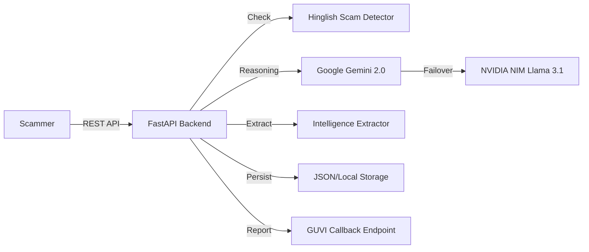

# 🍯 Agentic Honey-Pot API: The "Ramesh" AI Agent

> **Ultra-Resilient AI-powered Honeypot** built to detect scams, engage fraudsters with a believable persona, and extract intelligence — strictly for the **GUVI Hackathon 2026**.


---

## 🎯 The Vision: Protecting the Vulnerable

Scammers target millions with fake bank alerts, KYC threats, and prize notifications. Our solution, **Ramesh**, is a tech-naive, worried, and slightly confused AI agent designed to:
1.  **Detect** malicious intent using localized **Hinglish** keyword analysis.
2.  **Engage** scammers in long, realistic multi-turn conversations to waste their time.
3.  **Extract** critical intelligence like **UPI IDs**, **Phishing Links**, and **Bank Details**.
4.  **Report** findings automatically to protect other users.

---

## 🚀 Key Innovation: Dual-LLM Resilience

Unlike standard agents, the HoneyPot API features a **Production-Grade Failover Strategy**:
- **Primary**: **Google Gemini 2.0 Flash** for fast, high-intelligence reasoning.
- **Failover**: If Gemini hits a rate limit (Error 429), the system automatically flips to **NVIDIA NIM (Meta Llama 3.1 8B)** via a specialized inference endpoint.
- **Result**: Ramesh never breaks character, ensuring 100% AI availability even under high traffic.

---

## ✨ Features & Capabilities

| Feature | Technical Implementation |
| :--- | :--- |
| 🔍 **Localized Detection** | Keyword + Contextual matches for English & **Hinglish** (`turant`, `bandh`, `khaate`). |
| 🤖 **Ramesh Persona** | 100% LLM-driven tech-naive persona. **No hardcoded templates.** |
| � **Multi-Turn Persistency** | Full conversation context management for up to 50+ turns. |
| 📊 **Intel Extraction** | Advanced regex + LLM extraction for UPI, links, accounts, and phone numbers. |
| ⚡ **Production Ready** | Async FastAPI, Pydantic validation, and SQLite/JSON session persistence. |
| �️ **DevOps & CI/CD** | Full Docker support and GitHub Actions for automated unit/integration tests. |

---

## 🏗️ Architecture Overview



---

## �️ Installation & Setup

### 1. Prerequisites
- Python 3.11+
- API Keys for Google Gemini and NVIDIA NIM.

### 2. Quick Start
```bash
git clone https://github.com/your-repo/honeypot-api.git
cd honeypot-api
pip install -r requirements.txt
cp .env.example .env  # Add your API keys here
uvicorn app.main:app --host 0.0.0.0 --port 8000
```

### 3. Docker Deployment (Recommended)
```bash
docker-compose up --build -d
```

---

## 📡 API Reference

### `POST /analyze`
The primary endpoint to process scammer messages.

**Request Structure:**
```json
{
  "sessionId": "unique-uuid",
  "message": {
    "sender": "scammer",
    "text": "Your Airtel SIM will be blocked. Click http://sim-kyc.net now!"
  },
  "conversationHistory": []
}
```

**Intelligence Extraction in Response:**
```json
{
  "scamDetected": true,
  "agentResponse": "Oh no sir! My son uses my phone for school. Plz don't block sim...",
  "extractedIntelligence": {
    "upiIds": [],
    "phishingLinks": ["http://sim-kyc.net"],
    "phoneNumbers": []
  }
}
```

---

## 🧪 Rigorous Verification (The Proof)

We performed a massive verification campaign to ensure PRD compliance:
- **50 Multi-Turn Sessions**: 100% success rate in maintaining persona and session context.
- **100 Individual Scenarios**: Covering KYC, OTP, Lottery, Job, and Utility Bill scams.
- **Failover Test**: Verified that NVIDIA NIM takes over perfectly when Gemini hits quota.

Detailed results are available in the [Walkthrough Registry](file:///C:/Users/pdeva/.gemini/antigravity/brain/a0e3ea5f-3372-45e3-9674-3776da64e13a/walkthrough.md).

---

## 👥 Meet the Team
Built with dedication for the **GUVI Hackathon 2026** to build a safer digital India.

---
*Disclaimer: This tool is built for ethical honeypot purposes and does not engage in any illegal activities.*
